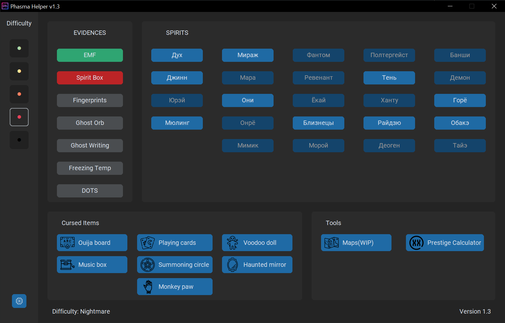

#  PhasmaHelper

Provides you with useful information about ghosts, their behaviors, 
needed evidences, weaknesses and strategies against them.

# Features

+ Easy to use interface
+ Overlay mode
+ Hide extra ghosts by checking evidences
+ Display ghost's behavior, advantages and strategy against them
+ Read about cursed items

# Instalation

## Portable
Just unzip anywhere.

## Installer
Run installer.exe and follow the installer instructions.

# Portable vs Installer
+ Installable version loads faster, and saves the config in the %appdata% if installed in `C:\Program Files`
+ Portable contains less files, and saves the config to `./config`

# Screenshots

# Credits

+ Inapp icons by <a href="https://www.flaticon.com/authors/freepik" title="Freepik - Flaticon">Freepik - Flaticon</a>
+ Voodoo icons created by <a href="https://www.flaticon.com/free-icons/voodoo" title="voodoo icons">Xnimrodx - Flaticon</a>
+ Monster icons created by <a href="https://www.flaticon.com/free-icons/monster" title="monster icons">Bellowen - Flaticon</a>
